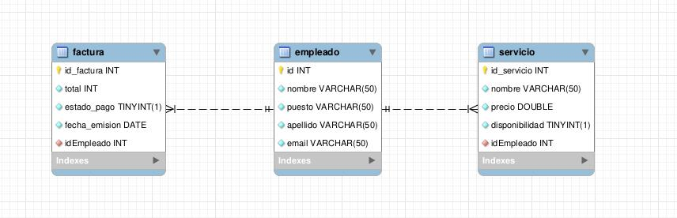

# Documentación Examen Symfoni

[//]: # "version: 1.0"
[//]: # "author: Manuel Ibáñez"
[//]: # "date: 2024-01-22"

## 1. Introducción

En este documento se va a explicar el funcionamiento de la aplicación web que se ha desarrollado para el examen de Symfoni.

## 2. Descripción de la aplicación

## 3. Descripción de la base de datos

La base de datos que se ha utilizado para el desarrollo de la aplicación web es la siguiente:



### 3.1 Consultas

```sql
INSERT INTO empleado (nombre, puesto, apellido, email)
VALUES ('Juan', 'Limpiador/a', 'Perez', 'juan.perez@example.com');

INSERT INTO empleado (nombre, puesto, apellido, email)
VALUES ('Maria', 'Cocinero/a', 'Gomez', 'maria.gomez@example.com');

INSERT INTO factura (total,idEmpleado,estado_pago,fecha_emision)
VALUES (100,1,true,'2021-01-01');

INSERT INTO factura (total,idEmpleado,estado_pago,fecha_emision)
VALUES (200,2,false,'2021-01-01');

INSERT INTO servicio (nombre,idEmpleado,precio,disponibilidad)
VALUES ('Servicio Habitaciones',1,100,true);

INSERT INTO servicio (nombre,idEmpleado,precio,disponibilidad)
VALUES ('Comida y cena',2,200,false);

```

## 4. Tecnologías utilizadas

Para el desarrollo de la aplicación web se han utilizado las siguientes tecnologías:

- PHP: Lenguaje de programación utilizado para el desarrollo de la aplicación web.
- Symfony: Framework de PHP utilizado para el desarrollo de la aplicación web.

## 5. Endpoints de la aplicación

A continuación se muestran los endpoints de la aplicación web:

### 5.1 Para la entidad Servicio

- http://127.0.0.1:8000/servicio/verServicios : Muestra los servicios disponibles.
- http://127.0.0.1:8000/servicio/eliminarServicio/2 : Elimina el servicio con id 2.
- http://127.0.0.1:8000/servicio/editarServicio/1/Reparacion/1000/1 : Edita el servicio con id 1.
- http://127.0.0.1:8000/servicio/insertarServicio : Inserta un nuevo servicio.

### 5.2 Para la entidad Empleado

- http://127.0.0.1:8000/empleado/verEmpleados : Muestra los empleados.
- http://127.0.0.1:8000/empleado/insertarEmpleado : Inserta un nuevo empleado.
- http://127.0.0.1:8000/empleado/verServicioEmpleado/1 : Muestra los servicios echos por un empleado concreto.

### 5.3 Para la entidad Factura

- http://127.0.0.1:8000/factura/verFacturas : Muestra las facturas.
- http://127.0.0.1:8000/factura/insertarFactura : Inserta una nueva factura.
- http://127.0.0.1:8000/factura/verFacturasEmpleado/1 : Muestra las facturas echas por un empleado concreto.
